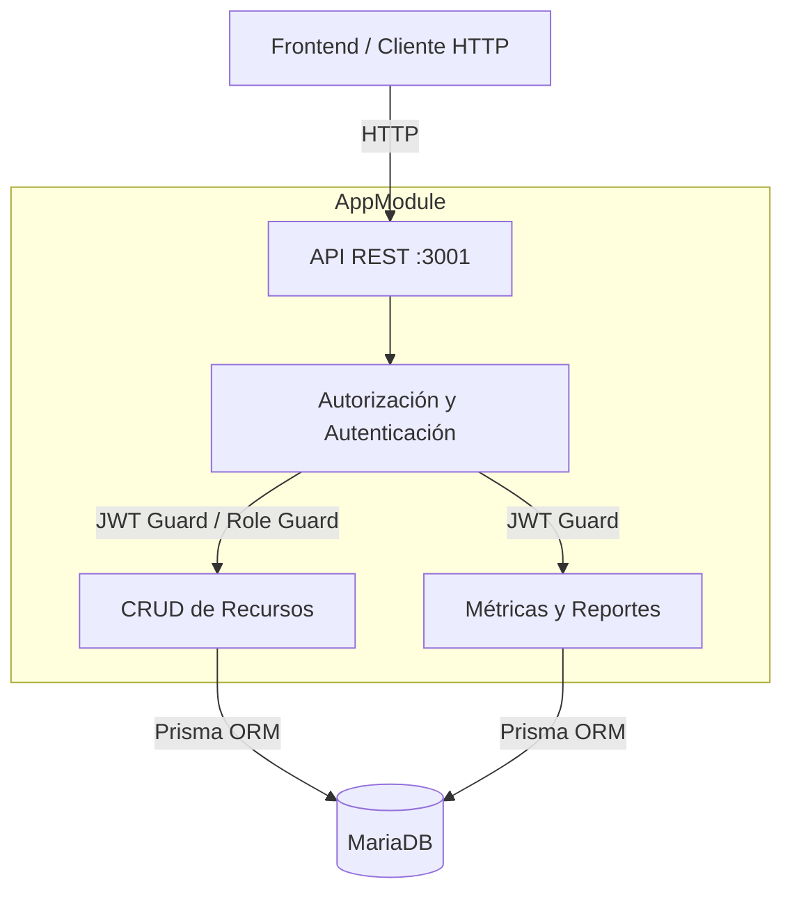
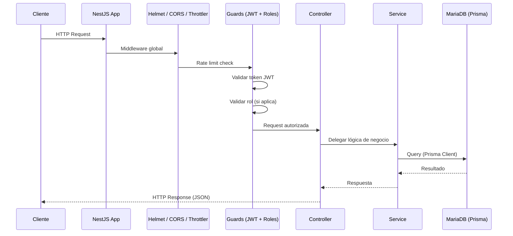

# Informe de Stack Tecnológico — CELC Backend

**Versión:** 1.0  
**Fecha:** 2026-06-04  
**Proyecto:** CELC — Centro de Excelencia en Logística y Calidad  
**Repositorio:** `celc-backend` (rama `Nuevo_Backend`)

---

## 1. Resumen Ejecutivo

El backend de CELC es una **API RESTful** construida con **NestJS** (TypeScript) que sigue los principios de **arquitectura modular** y **orientada a servicios**. Proporciona endpoints para la gestión de usuarios, líneas celulares, equipos, asignaciones, revisiones, reportes y métricas, todo protegido con **autenticación JWT** y **control de roles**.

---

## 2. Stack Tecnológico

### 2.1 Lenguaje y Runtime

| Tecnología  | Versión    | Propósito                                |
|-------------|------------|------------------------------------------|
| TypeScript  | ~5.7.3     | Tipado estático y features de ES moderno |
| Node.js     | (>=18)     | Runtime del servidor                     |
| pnpm        | —          | Gestor de paquetes (workspace monorepo)  |

### 2.2 Framework Principal

| Tecnología | Versión | Propósito                                           |
|------------|---------|-----------------------------------------------------|
| **NestJS** | ^11.0   | Framework progresivo de Node.js con arquitectura modular (controllers, services, modules, guards, pipes, filters, middleware) |
| Express    | —       | Plataforma HTTP subyacente (vía `@nestjs/platform-express`) |
| RxJS       | ^7.8    | Programación reactiva y observables (incluido con NestJS) |
| ReflectMetadata | ^0.2.2 | Decorators y metadatos para NestJS y TypeScript |

### 2.3 Base de Datos y ORM

| Tecnología         | Versión | Propósito                                            |
|--------------------|---------|------------------------------------------------------|
| **MariaDB**        | —       | Motor de base de datos (conector `mariadb` ^3.5.2)   |
| **Prisma**         | ^7.8    | ORM moderno con type-safety, migraciones y adapter   |
| `@prisma/adapter-mariadb` | ^7.8 | Driver adapter para MariaDB (en lugar del connector string tradicional) |
| `mysql2`           | ^3.15   | Driver MySQL alternativo (disponible en dependencias) |

**Modelos (entidades del schema):**

| Modelo          | Descripción                                     |
|-----------------|-------------------------------------------------|
| `Usuario`       | Usuarios del sistema con roles, autenticación   |
| `Rol`           | Roles (Administrador, Técnico, Empleado)         |
| `Linea`         | Líneas telefónicas celulares                     |
| `Equipo`        | Equipos/terminales celulares                     |
| `Asignacion`    | Asignación de equipos/líneas a usuarios          |
| `Revision`      | Revisiones programadas de equipos                |
| `RegistroError` | Log de errores de la aplicación                  |

**Enums nativos de Prisma:** `LineasEstado`, `EquiposEstado`, `RevisionesResultado`

### 2.4 Autenticación y Seguridad

| Tecnología      | Versión | Propósito                                        |
|-----------------|---------|--------------------------------------------------|
| **JWT** (`jsonwebtoken`) | ^9.0 | Tokens de autenticación con expiración (8h)      |
| **Passport**    | ^0.7    | Estrategia JWT (`passport-jwt` ^4.0)             |
| **bcrypt**      | ^6.0    | Hashing de contraseñas (10 rounds de salt)       |
| **Helmet**      | ^8.2    | Headers HTTP seguros                              |
| **CORS**        | ^2.8    | Middleware de CORS configurado para orígenes específicos |
| **class-validator / class-transformer** | ^0.14 / ^0.5 | Validación y transformación de DTOs |

### 2.5 Documentación API

| Tecnología       | Versión | Propósito                                        |
|------------------|---------|--------------------------------------------------|
| **Swagger / OpenAPI** (`@nestjs/swagger`) | ^11.2 | Documentación interactiva con UI Swagger en `/api` |
| `swagger-ui-express` | —    | UI de Swagger incluida con el módulo             |

### 2.6 Seguridad y Rate Limiting

| Tecnología                | Versión | Propósito                           |
|---------------------------|---------|-------------------------------------|
| **@nestjs/throttler**     | ^6.5    | Rate limiting: 100 requests por 60s |

### 2.7 Configuración

| Tecnología           | Versión | Propósito                           |
|----------------------|---------|-------------------------------------|
| **@nestjs/config**   | ^4.0    | Variables de entorno (`.env`)        |
| **dotenv**           | ^17.2   | Carga de entorno                     |

### 2.8 Testing

| Tecnología   | Versión | Propósito                                     |
|--------------|---------|-----------------------------------------------|
| **Jest**     | ^30.0   | Test runner unitario y de integración          |
| **Supertest**| ^7.0    | Pruebas E2E sobre HTTP                         |
| **ts-jest**  | ^29.2   | Transformador TypeScript para Jest             |

### 2.9 Herramientas de Desarrollo

| Tecnología                | Versión | Propósito                           |
|---------------------------|---------|-------------------------------------|
| ESLint + `typescript-eslint` | ^9 / ^8 | Linter con config plana            |
| Prettier                  | ^3.4    | Formateador de código               |
| `ts-node` / `ts-loader`   | ^10 / ^9 | Ejecución y compilación TypeScript |

---

## 3. Arquitectura

### 3.1 Patrón Arquitectónico

El backend sigue la **arquitectura modular** de NestJS, que organiza el código en **módulos funcionales** cohesivos. Cada módulo encapsula:

- **Controller**: Define los endpoints REST y delega al service.
- **Service**: Contiene la lógica de negocio e interactúa con la base de datos vía Prisma.
- **DTOs** (Data Transfer Objects): Definen la estructura y validación de datos de entrada/salida.
- **Module**: Agrupa controllers, services y dependencias.

Además, existen **módulos transversales** compartidos:

- **Auth Module**: Autenticación, guards JWT y guards de roles.
- **Database Module**: Conexión a MariaDB vía Prisma Client expuesto como servicio singleton.
- **Common Module**: Filtros globales de excepciones.

### 3.2 Diagrama de Arquitectura



### 3.3 Flujo de Petición



---

## 4. Estructura de Archivos

```
celc-backend/
├── prisma/
│   └── schema.prisma              # Schema de base de datos (6 modelos + 3 enums)
│
├── src/
│   ├── main.ts                    # Punto de entrada: bootstrap, Swagger, CORS, Helmet, ValidationPipe
│   ├── app.module.ts              # Módulo raíz: importa todos los módulos funcionales
│   ├── app.controller.ts          # Health check o endpoint raíz
│   ├── app.service.ts             # Servicio raíz
│   │
│   ├── auth/                      # Módulo de autenticación
│   │   ├── auth.module.ts         #   Registro de dependencias
│   │   ├── auth.controller.ts     #   POST /api/auth/register, POST /api/auth/login, GET /api/auth/verify
│   │   ├── auth.service.ts        #   Lógica: register, login, getProfile
│   │   ├── auth.dto.ts            #   DTOs: RegisterDto, LoginDto
│   │   ├── jwt.guard.ts           #   Guard: valida token JWT en headers
│   │   ├── jwt.middleware.ts      #   Middleware JWT (alternativa)
│   │   ├── role.guard.ts          #   Guard: verifica rol del usuario (1=Admin, 2=Técnico, 3=Empleado)
│   │   └── user.interface.ts      #   Interface del payload JWT
│   │
│   ├── usuarios/                  # Módulo de gestión de usuarios
│   │   ├── usuarios.module.ts
│   │   ├── usuarios.controller.ts #   CRUD: /api/usuarios (protegido con JWT + roles)
│   │   ├── usuarios.service.ts    #   findAll, findById, create, update, delete
│   │   └── usuarios.dto.ts       #   DTOs: CreateUsuarioDto, UpdateUsuarioDto, UsuarioResponseDto
│   │
│   ├── lineas/                    # Módulo de líneas celulares
│   │   ├── lineas.module.ts
│   │   ├── lineas.controller.ts   #   CRUD + toggle: /api/lineas
│   │   ├── lineas.service.ts      #   findAll, findById, create, update, delete, toggleStatus
│   │   └── lineas.dto.ts          #   DTOs + enum LineasEstado local
│   │
│   ├── equipos/                   # Módulo de equipos
│   │   ├── equipos.module.ts
│   │   ├── equipos.controller.ts  #   CRUD: /api/equipos
│   │   └── equipos.service.ts     #   CRUD básico
│   │
│   ├── asignaciones/              # Módulo de asignaciones
│   │   ├── asignaciones.module.ts
│   │   ├── asignaciones.controller.ts  # CRUD: /api/asignaciones
│   │   └── asignaciones.service.ts     # CRUD con relaciones
│   │
│   ├── revisiones/                # Módulo de revisiones/mantenimiento
│   │   ├── revisiones.module.ts
│   │   ├── revisiones.controller.ts    # CRUD: /api/revisiones
│   │   └── revisiones.service.ts       # CRUD
│   │
│   ├── reportes/                  # Módulo de reportes
│   │   ├── reportes.module.ts
│   │   ├── reportes.controller.ts #   GET /api/reportes/lineas, /equipos, /asignaciones
│   │   ├── reportes.service.ts    #   Generación de reportes con filtros
│   │   └── reportes.dto.ts        #   Filtros y respuesta
│   │
│   ├── metricas/                  # Módulo de métricas (dashboard)
│   │   ├── metricas.module.ts
│   │   ├── metricas.controller.ts #   GET /api/metricas/lineas-activas, /equipos-reparacion, /revisiones-proximas, /dashboard
│   │   └── metricas.service.ts    #   Estadísticas agregadas
│   │
│   ├── database/                  # Módulo de base de datos
│   │   ├── database.module.ts     #   Exporta DatabaseService
│   │   └── database.service.ts    #   PrismaClient wrapper con adapter MariaDB
│   │
│   └── common/                    # Recursos compartidos
│       └── http-exception.filter.ts  # Filtro global de excepciones (maneja errores HTTP + Prisma codes)
│
├── test/                          # Tests E2E
│   ├── app.e2e-spec.ts
│   └── jest-e2e.json
│
├── docs/                          # Documentación
│   └── STACK_TECNOLOGICO.md       # ← Este archivo
│
├── .env                           # Variables de entorno (DB, JWT_SECRET, PORT)
├── package.json                   # Dependencias y scripts
├── pnpm-workspace.yaml            # Config workspace monorepo
├── nest-cli.json                  # Configuración de NestJS CLI
├── tsconfig.json                  # Config TypeScript (ES2023, decorators, nodenext)
├── tsconfig.build.json            # Config build
├── eslint.config.mjs             # ESLint flat config
├── prisma.config.ts               # Config Prisma para CLI
└── README.md
```

---

## 5. Endpoints de la API

| Método  | Ruta                         | Módulo       | Auth       | Roles        |
|---------|------------------------------|--------------|------------|--------------|
| POST    | `/api/auth/register`         | Auth         | ❌         | —            |
| POST    | `/api/auth/login`            | Auth         | ❌         | —            |
| GET     | `/api/auth/verify`           | Auth         | ✅ JWT     | —            |
| GET     | `/api/usuarios`              | Usuarios     | ✅ JWT     | Admin (1)    |
| GET     | `/api/usuarios/:id`          | Usuarios     | ✅ JWT     | —            |
| POST    | `/api/usuarios`              | Usuarios     | ✅ JWT     | Admin (1)    |
| PUT     | `/api/usuarios/:id`          | Usuarios     | ✅ JWT     | —            |
| DELETE  | `/api/usuarios/:id`          | Usuarios     | ✅ JWT     | Admin (1)    |
| GET     | `/api/lineas`                | Líneas       | ✅ JWT     | —            |
| GET     | `/api/lineas/:id`            | Líneas       | ✅ JWT     | —            |
| POST    | `/api/lineas`                | Líneas       | ✅ JWT     | Admin/Técnico |
| PUT     | `/api/lineas/:id`            | Líneas       | ✅ JWT     | —            |
| DELETE  | `/api/lineas/:id`            | Líneas       | ✅ JWT     | Admin/Técnico |
| PUT     | `/api/lineas/:id/toggle`     | Líneas       | ✅ JWT     | Admin/Técnico |
| GET     | `/api/equipos`               | Equipos      | ✅ JWT     | —            |
| GET     | `/api/equipos/:id`           | Equipos      | ✅ JWT     | —            |
| POST    | `/api/equipos`               | Equipos      | ✅ JWT     | —            |
| PUT     | `/api/equipos/:id`           | Equipos      | ✅ JWT     | —            |
| DELETE  | `/api/equipos/:id`           | Equipos      | ✅ JWT     | —            |
| GET     | `/api/asignaciones`          | Asignaciones | ✅ JWT     | —            |
| GET     | `/api/asignaciones/:id`      | Asignaciones | ✅ JWT     | —            |
| POST    | `/api/asignaciones`          | Asignaciones | ✅ JWT     | —            |
| PUT     | `/api/asignaciones/:id`      | Asignaciones | ✅ JWT     | —            |
| DELETE  | `/api/asignaciones/:id`      | Asignaciones | ✅ JWT     | —            |
| GET     | `/api/revisiones`            | Revisiones   | ✅ JWT     | —            |
| GET     | `/api/revisiones/:id`        | Revisiones   | ✅ JWT     | —            |
| POST    | `/api/revisiones`            | Revisiones   | ✅ JWT     | —            |
| PUT     | `/api/revisiones/:id`        | Revisiones   | ✅ JWT     | —            |
| GET     | `/api/reportes/lineas`       | Reportes     | ✅ JWT     | —            |
| GET     | `/api/reportes/equipos`      | Reportes     | ✅ JWT     | —            |
| GET     | `/api/reportes/asignaciones` | Reportes     | ✅ JWT     | —            |
| GET     | `/api/metricas/lineas-activas`  | Métricas  | ✅ JWT     | —            |
| GET     | `/api/metricas/equipos-reparacion` | Métricas | ✅ JWT  | —            |
| GET     | `/api/metricas/revisiones-proximas` | Métricas | ✅ JWT | —            |
| GET     | `/api/metricas/dashboard`    | Métricas     | ✅ JWT     | —            |

**Documentación interactiva:** Disponible en `/api` vía Swagger UI.

---

## 6. Decisiones Técnicas

### 6.1 Prisma con MariaDB Adapter

Se utiliza `@prisma/adapter-mariadb` en lugar del string de conexión tradicional. Esto proporciona una integración nativa con el driver `mariadb`, mejor performance y type-safety total.

### 6.2 Autenticación con JWT + Roles

- **JWT Guard** protege rutas verificando el token Bearer en el header `Authorization`.
- **Role Guard** verifica que el `id_rol` del usuario tenga permisos suficientes (1=Admin, 2=Técnico, 3=Empleado).
- Sistema de roles flexible vía tabla `Roles` en BD.

### 6.3 Validación y Transformación

Se usa `class-validator` + `class-transformer` con un `ValidationPipe` global configurado con:
- `whitelist: true` — elimina propiedades no decoradas
- `forbidNonWhitelisted: true` — rechaza propiedades desconocidas
- `transform: true` — transforma tipos automáticamente

### 6.4 Manejo Global de Excepciones

El `AllExceptionsFilter` captura:
- Errores HTTP estándar
- Códigos de error de Prisma (P2002 = unique constraint, P2003 = foreign key)
- Traduce mensajes a español según el campo conflictivo

### 6.5 Rate Limiting

Protegido con `@nestjs/throttler` a 100 requests por ventana de 60 segundos a nivel global.

### 6.6 Documentación Swagger

Swagger configurado con agrupación por tags, autorización Bearer persistente, y ordenamiento alfabético de tags y operaciones.

---

## 7. Scripts Disponibles

| Script          | Comando                        | Descripción                         |
|-----------------|--------------------------------|-------------------------------------|
| `build`         | `nest build`                   | Compila el proyecto                 |
| `start`         | `nest start`                   | Inicia en producción                |
| `start:dev`     | `nest start --watch`           | Modo desarrollo con hot-reload      |
| `start:debug`   | `nest start --debug --watch`   | Modo debug                          |
| `lint`          | `eslint ... --fix`             | Lintea y corrige automáticamente    |
| `test`          | `jest`                         | Tests unitarios                     |
| `test:e2e`      | `jest --config ./test/jest-e2e.json` | Tests end-to-end           |

---

## 8. Dependencias del Entorno

- **Servidor:** Node.js ≥ 18
- **Base de Datos:** MariaDB (o MySQL compatible)
- **Puerto por defecto:** 3001 (configurable vía `PORT`)
- **Variables de entorno requeridas:** `DB_HOST`, `DB_PORT`, `DB_USER`, `DB_PASSWORD`, `DB_DATABASE`, `JWT_SECRET`

---

*Informe generado a partir del análisis del código fuente del repositorio `celc-backend`.*
